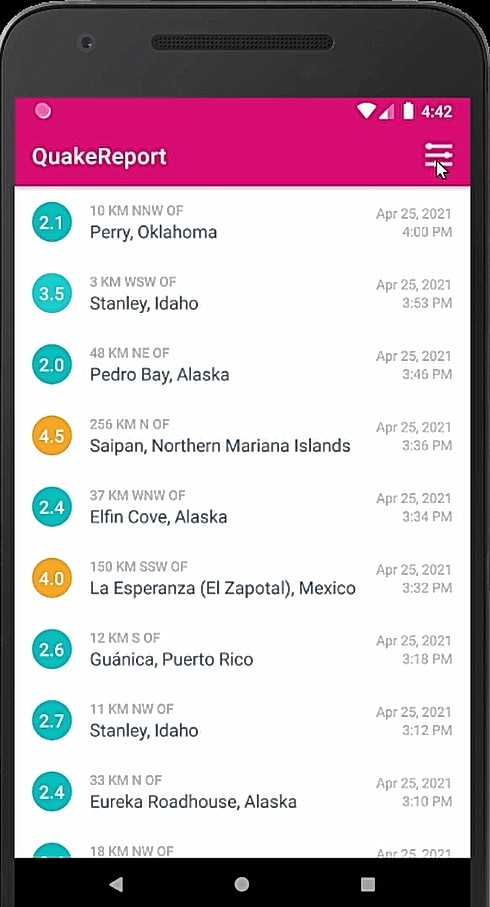
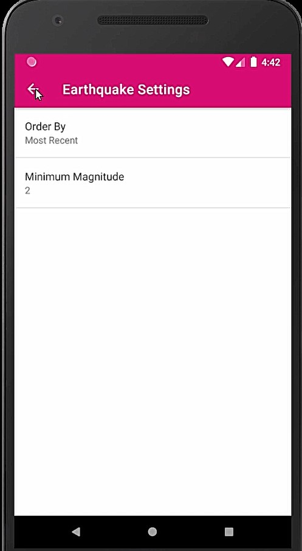
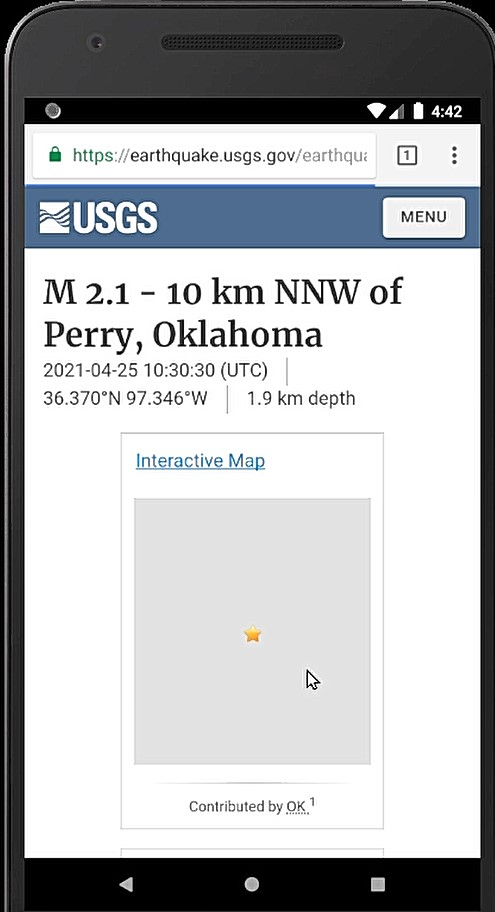
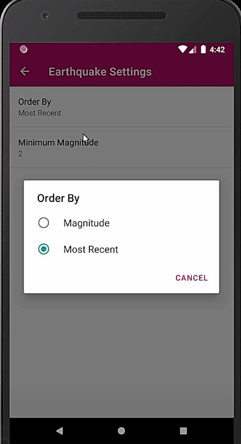

# Quake Report App

This app displays a list of recent earthquakes in the world from the U.S. Geological Survey (USGS) organization. 
I learned to build this app in a Udacity course (Android Basics: Networking).

More info on the USGS Earthquake API available at: https://earthquake.usgs.gov/fdsnws/event/1/

The data is fetched from the U.S. Geological Survey (USGS) organization.
The fetched data is displayed in the app.

ScreenShots
---------------

Lessons Learned
----------
QuakeReport App learn about JSON,Parsing JSON,URL,Switch statement,Intent,Permissions,Http request method,
Http response code,Exceptions,try catch finally,String builder,Threads,Background thread,AsyncTask ,Inner Class,
Input stream,Buffer reader
,Handle Null cases,Loaders,Loading indicators,Preferences,Fragments.
